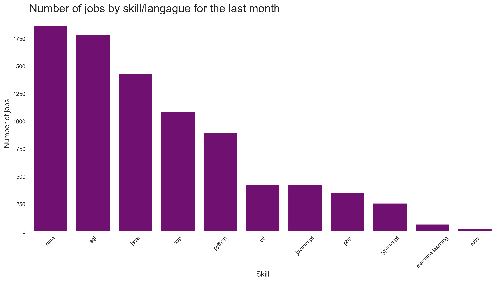

# Demand Tracker of IT projects for freelancers, France

*Last update: 2023-12-25*

> Get weekly updates by joining the [telegram
> channel](https://t.me/+3y9PJaF335UxYTg0)

# If you are new read this, otherwise go straight to the charts

## Am I the only freelancer suffering from a decreasing demand?

**The goal of this page is to provide you with an overview of the demand for IT freelancers in France. It may not fully reflect the market, as it is based on the information we could gather from various sources.**
Now, let's examine the extent of the damage, who is affected, and what the current demand looks like.

## Perimeter

Date: From May 2023

Projects: 50k job offers for freelancers in IT / Tech / Data

For this edition, we are publishing the charts without commentary. Please be aware that past figures might vary slightly due to data cleansing, but the overall trends remain consistent

## Demand Dynamics

## Rate Trends

## Experience Metrics

### Aggregate Demand by Experience

### Experience-wise Demand Trends

### Experience-Adjusted Rates

### Most popular languages and skills

## Language Proficiency and Rates

For exclusive analyses, subscribe to our [Telegram channel](https://t.me/+3y9PJaF335UxYTg0).

For inquiries or suggestions, [contact us via email](mailto:meryem@spreyd.com?subject=[Freelance IT Tracker]).
