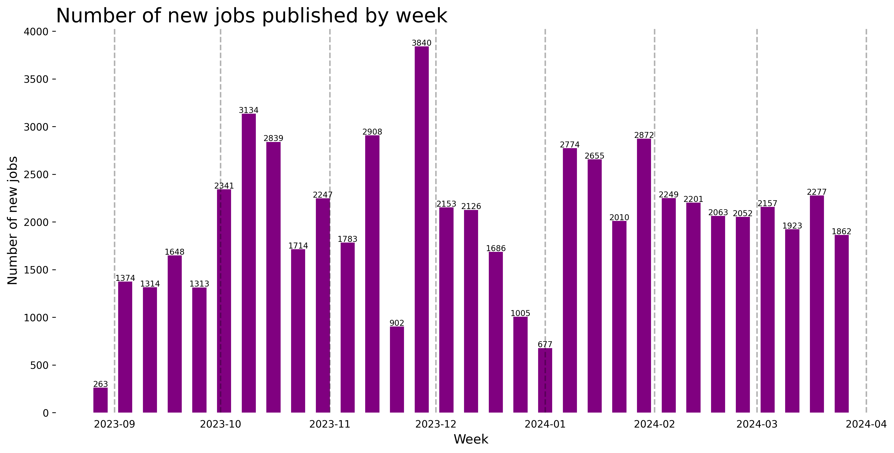
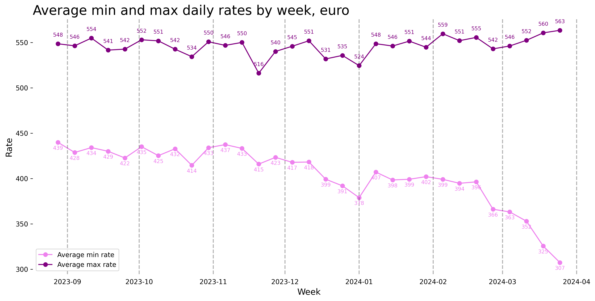
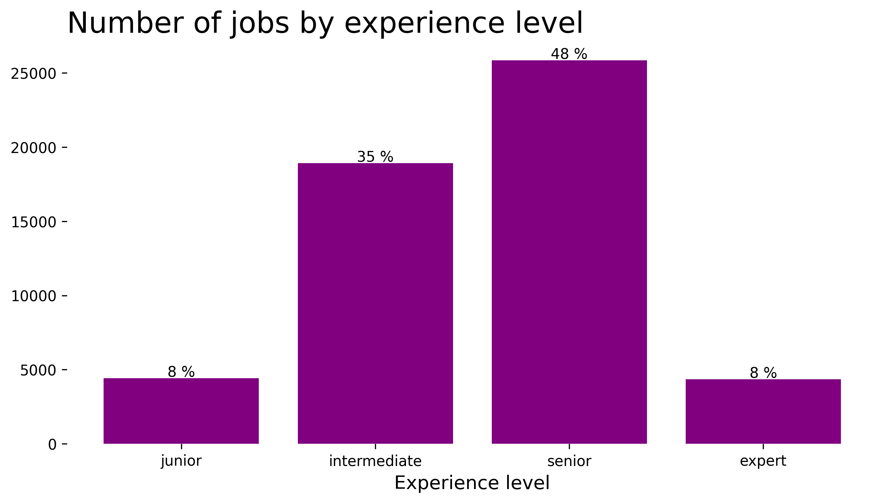
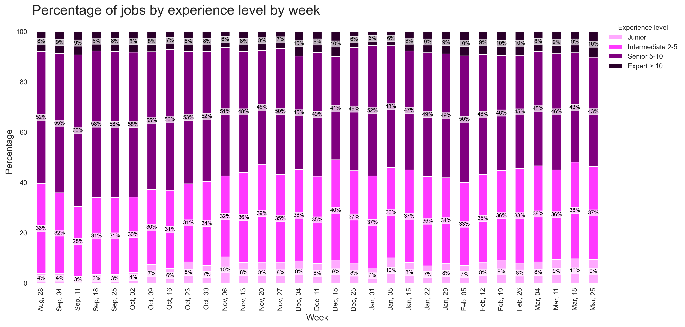
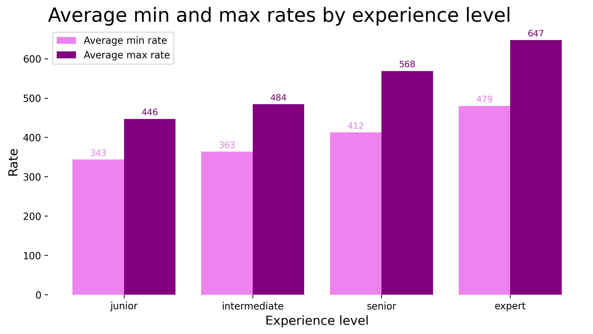
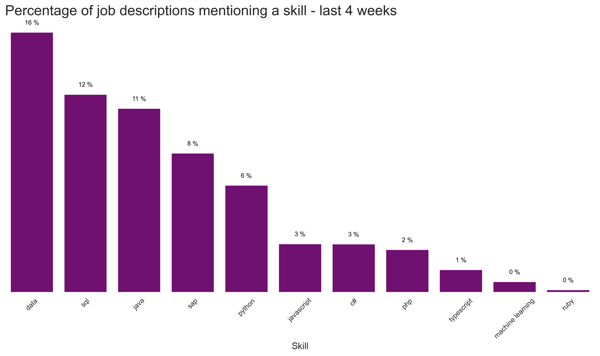
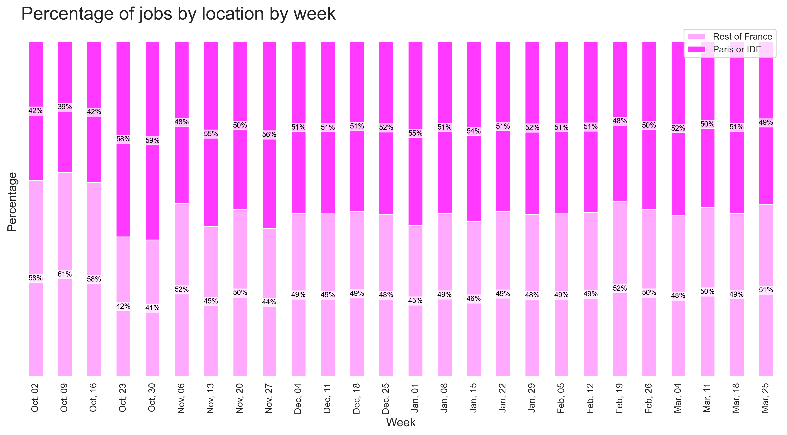
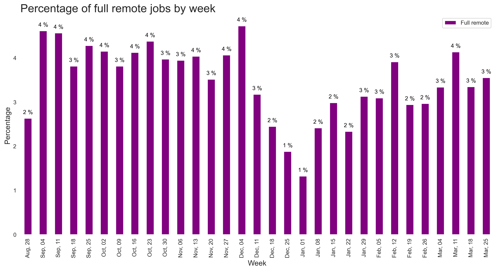
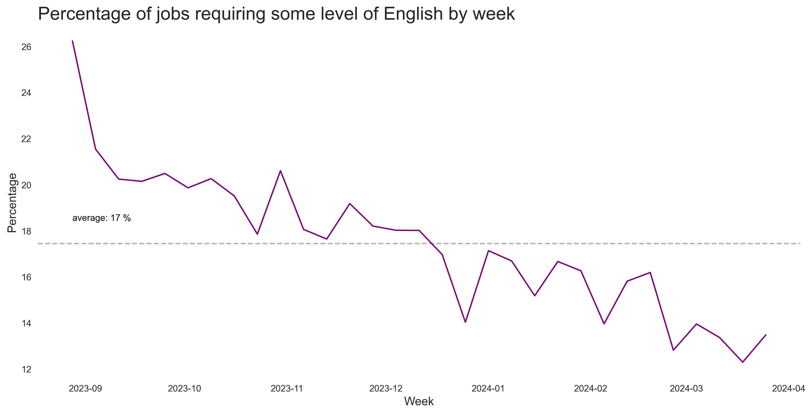
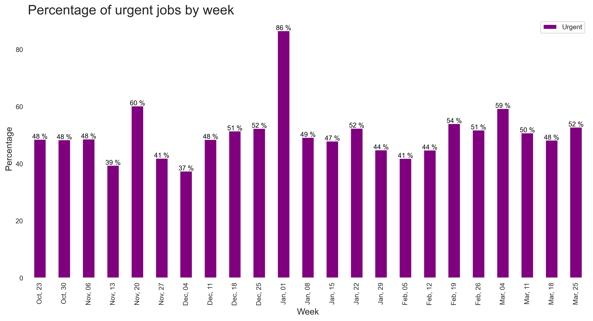

# Demand Tracker of IT projects for freelancers, France

*Last update: 2024-04-01*

> Get weekly updates by joining the [telegram channel](https://t.me/+3y9PJaF335UxYTg0)

Am I the only freelancer suffering from a decreasing demand?

**This page privodes you with an overview of the demand for IT freelancers in France. It may not fully reflect the market, as it is based on the information we could gather from various sources.**

Now, let's examine the extent of the damage, who is affected, and what the current demand looks like.

## Perimeter

Date: From May 2023

Projects: ~76k job offers for freelancers in IT / Tech / Data

**This week, we'll trim the data to the past 6 months for clearer charts.**

## Demand Dynamics

## Rate Trends

## Experience Metrics

### Aggregate Demand by Experience

### Experience-wise Demand Trends

### Experience-Adjusted Rates

On average experts earn 242€/day more than juniors

### Most popular languages and skills

Clients want data, databases, java and SAP.

## Location

### Paris vs Province

Half of the demand is in Paris or region

### Remote job

A small percentage of jobs are remote

Approximately 20% of jobs require a degree of English proficiency, and this percentage appears to be declining.

## Mission Starts 5 min ago

More than half of the jobs are expected to starts few days after the job is advertised

For exclusive analyses, subscribe to our [Telegram channel](https://t.me/+3y9PJaF335UxYTg0).

For inquiries or suggestions, [contact us via email](mailto:meryem@spreyd.com?subject=[Freelance IT Tracker]).
