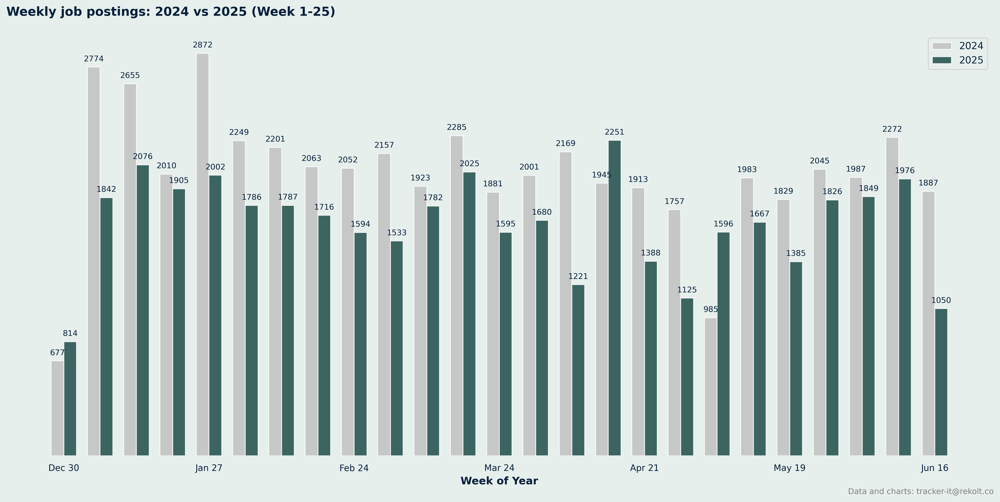
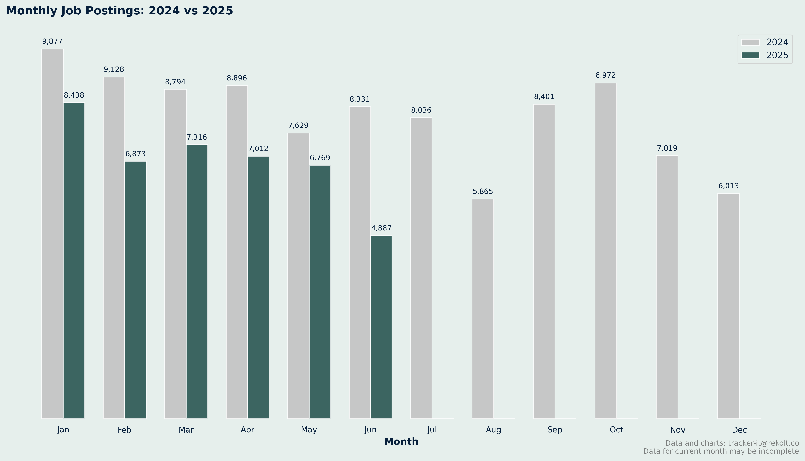
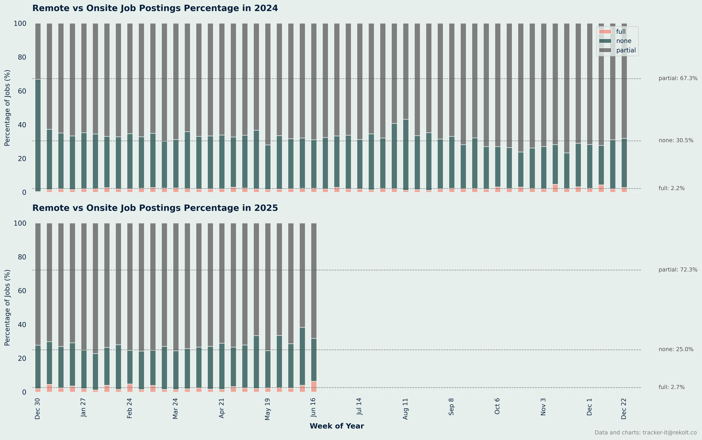
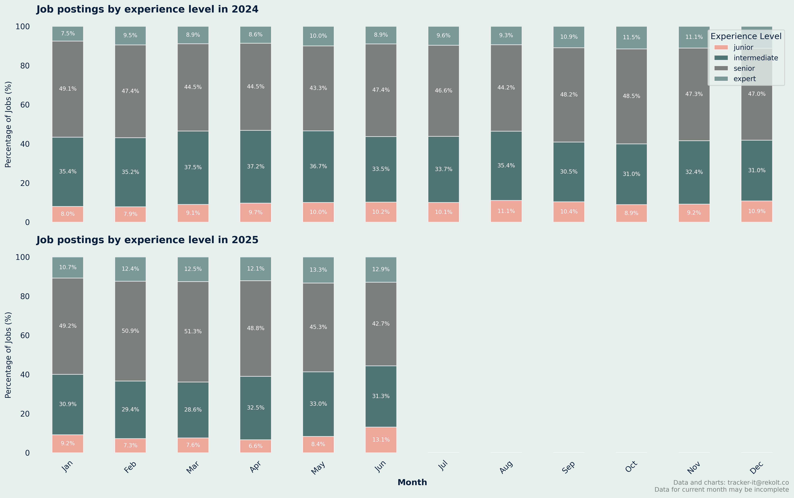
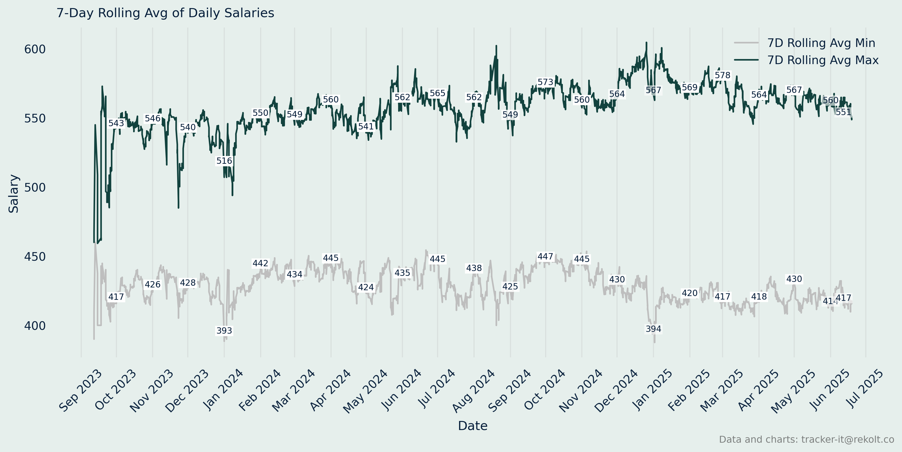

## Weekly Job Postings Summary

Every week, we deliver a comprehensive analysis of the French IT freelance landscape.

This report includes insights on job postings, remote work trends, salary analysis, and more.
* We maintain a backlog of analysis ideas. Send yours to tracker-it@rekolt.co.
* Join our [telegram channel](https://t.me/+3y9PJaF335UxYTg0) for weekly updates and for occasional REKOLT project briefs and mission descriptions.

### report for week starting June 16, 2025


### Weekly Vs Last Year Summary

```markdown

📈 Comparison Summary
2025: 25 weeks, 41471 total jobs, avg 1659 jobs/week
2024: 25 weeks, 50572 total jobs, avg 2023 jobs/week

```



### Ytd Cumlated Summary

```markdown

📈 Year-over-Year Comparison (Week 25):
2024: 50572 cumulative jobs
2025: 41471 cumulative jobs
Growth: -18.0%

```


### Month On Month Vs Last Year Summary

```markdown

📊 Monthly Job Postings Summary:
Jan: 2024=9877, 2025=8438
Feb: 2024=9128, 2025=6873
Mar: 2024=8794, 2025=7316
Apr: 2024=8896, 2025=7012
May: 2024=7629, 2025=6769
Jun: 2024=8331, 2025=4887
Jul: 2024=8036, 2025=  0
Aug: 2024=5865, 2025=  0
Sep: 2024=8401, 2025=  0
Oct: 2024=8972, 2025=  0
Nov: 2024=7019, 2025=  0
Dec: 2024=6013, 2025=  0

```



### Remote Vs Onsite Percentage Summary

```markdown

📊 Remote vs Onsite Job Postings Percentage Summary:
2024: 5200 total jobs
	 Remote: 116 per week
		 percentage: 2.2%
	 Partial: 3500 per week
		 percentage: 67.3%
2025: 2500 total jobs
	 Remote: 67 per week
		 percentage: 2.7%
	 Partial: 1807 per week
		 percentage: 72.3%

```



### Experience Level Summary

```markdown
 Monthly Job Postings by Experience Level Summary:
2024:
	 Junior: 14849 jobs
		 percentage: 9.1%
	 Intermediate: 54832 jobs
		 percentage: 33.4%
	 Senior: 77951 jobs
		 percentage: 47.5%
	 Expert: 16382 jobs
		 percentage: 10.0%
2025:
	 Junior: 14849 jobs
		 percentage: 9.1%
	 Intermediate: 54832 jobs
		 percentage: 33.4%
	 Senior: 77951 jobs
		 percentage: 47.5%
	 Expert: 16382 jobs
		 percentage: 10.0%

```



### Annual Salary Summary

```markdown
 Annual Salary Summary:
2023:
	 Average min salary: 428 (min: 100, max: 950)
	 Average max salary: 543 (min: 180, max: 1760)

2024:
	 Average min salary: 434 (min: 100, max: 3000)
	 Average max salary: 560 (min: 100, max: 3000)

2025:
	 Average min salary: 419 (min: 100, max: 3000)
	 Average max salary: 567 (min: 100, max: 3000)

```



