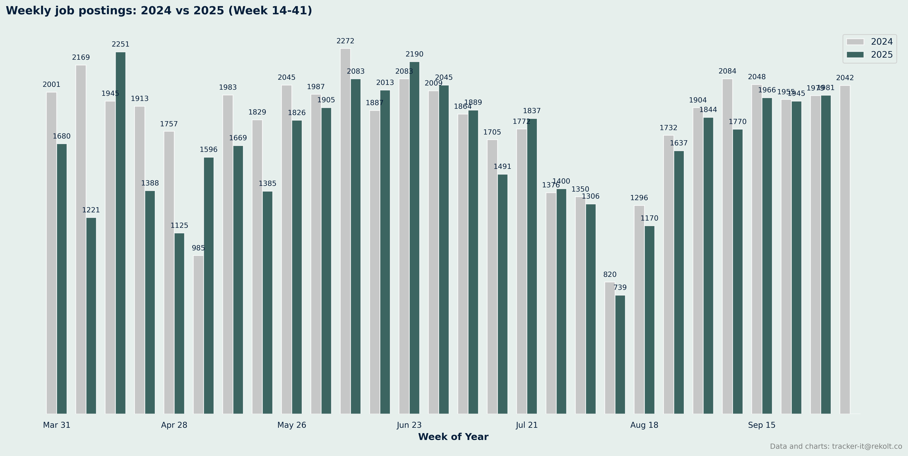
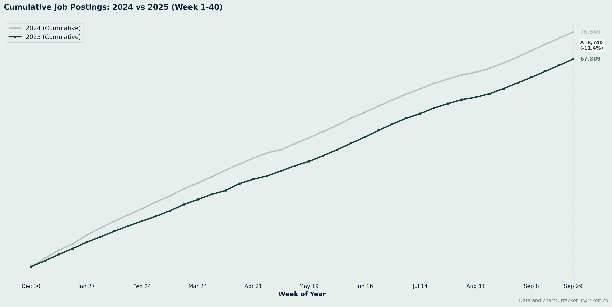
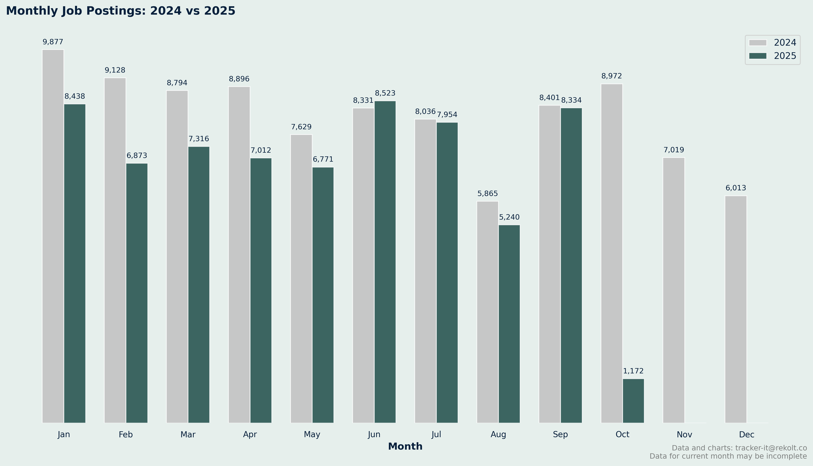
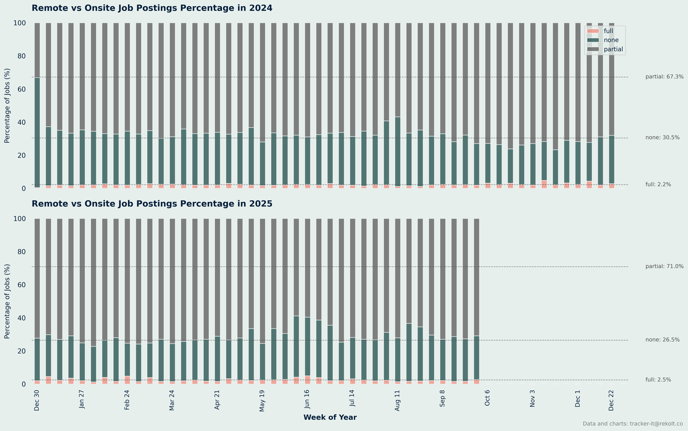
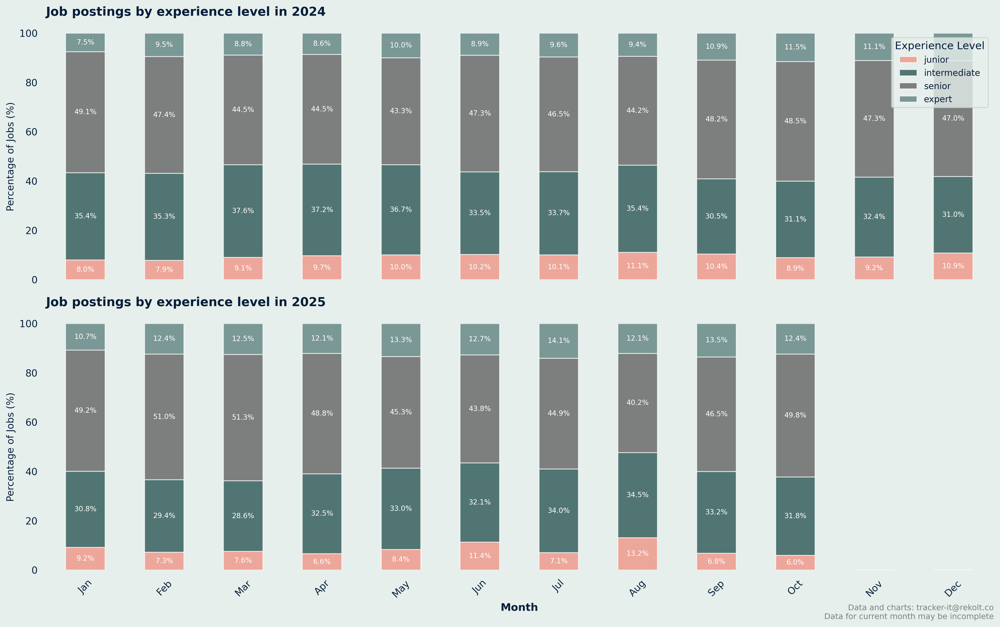
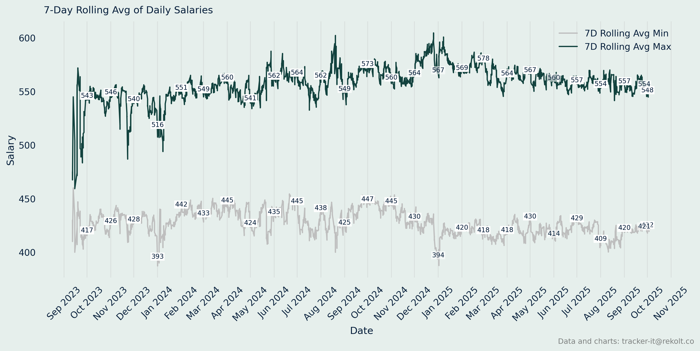

## Weekly Job Postings Summary

Every week, we deliver a comprehensive analysis of the French IT freelance landscape.

This report includes insights on job postings, remote work trends, salary analysis, and more.
* We maintain a backlog of analysis ideas. Send yours to tracker-it@rekolt.co.
* Join our [telegram channel](https://t.me/+3y9PJaF335UxYTg0) for weekly updates and for occasional REKOLT project briefs and mission descriptions.

### report for week starting September 29, 2025


### Weekly Vs Last Year Summary

```markdown
📈 Comparison Summary
2025: 27 weeks, 45352 total jobs, avg 1680 jobs/week
2024: 27 weeks, 48750 total jobs, avg 1806 jobs/week

```



### Ytd Cumlated Summary

```markdown

📈 Year-over-Year Comparison (Week 40):
2024: 76549 cumulative jobs
2025: 67809 cumulative jobs
Growth: -11.4%

```



### Month On Month Vs Last Year Summary

```markdown

📊 Monthly Job Postings Summary:
Jan: 2024=9877, 2025=8438
Feb: 2024=9128, 2025=6873
Mar: 2024=8794, 2025=7316
Apr: 2024=8896, 2025=7012
May: 2024=7629, 2025=6771
Jun: 2024=8331, 2025=8523
Jul: 2024=8036, 2025=7954
Aug: 2024=5865, 2025=5240
Sep: 2024=8401, 2025=8334
Oct: 2024=8972, 2025=1172
Nov: 2024=7019, 2025=  0
Dec: 2024=6013, 2025=  0

```



### Remote Vs Onsite Percentage Summary

```markdown

📊 Remote vs Onsite Job Postings Percentage Summary:
2024: 5200 total jobs
	 Remote: 116 per week
		 percentage: 2.2%
	 Partial: 3500 per week
		 percentage: 67.3%
2025: 4000 total jobs
	 Remote: 99 per week
		 percentage: 2.5%
	 Partial: 2839 per week
		 percentage: 71.0%

```



### Experience Level Summary

```markdown
 Monthly Job Postings by Experience Level Summary:
2024:
	 Junior: 16912 jobs
		 percentage: 9.0%
	 Intermediate: 63160 jobs
		 percentage: 33.5%
	 Senior: 89008 jobs
		 percentage: 47.2%
	 Expert: 19648 jobs
		 percentage: 10.4%
2025:
	 Junior: 16912 jobs
		 percentage: 9.0%
	 Intermediate: 63160 jobs
		 percentage: 33.5%
	 Senior: 89008 jobs
		 percentage: 47.2%
	 Expert: 19648 jobs
		 percentage: 10.4%

```



### Annual Salary Summary

```markdown
 Annual Salary Summary:
2023:
	 Average min salary: 428 
	 Average max salary: 543 

2024:
	 Average min salary: 434 
	 Average max salary: 560 

2025:
	 Average min salary: 420 
	 Average max salary: 563 

```



