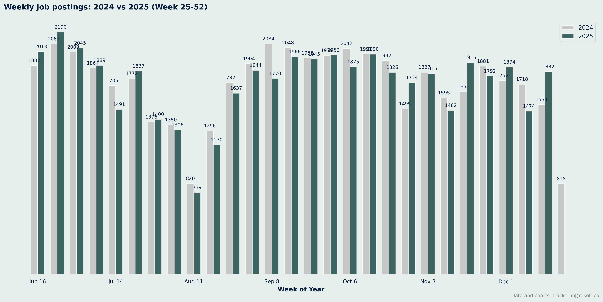
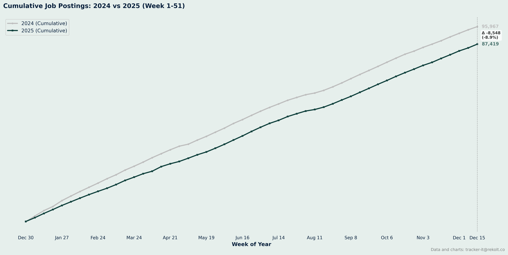
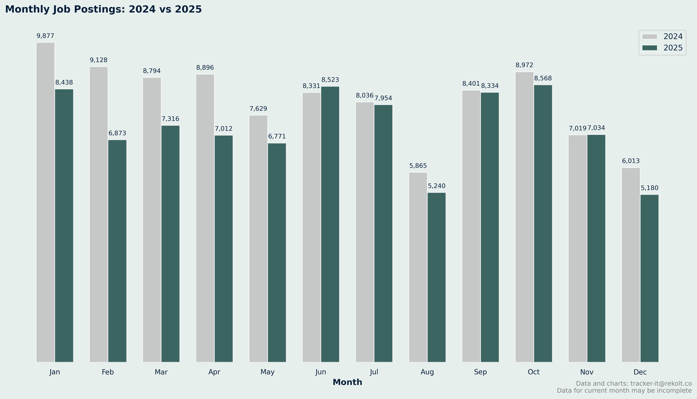
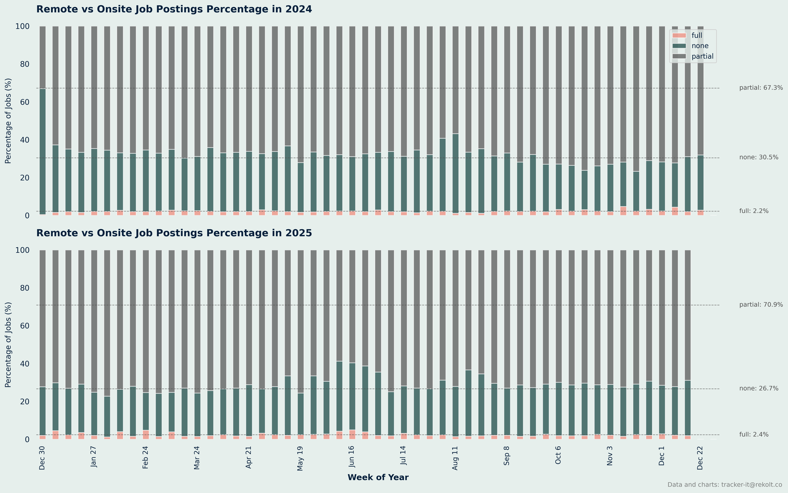
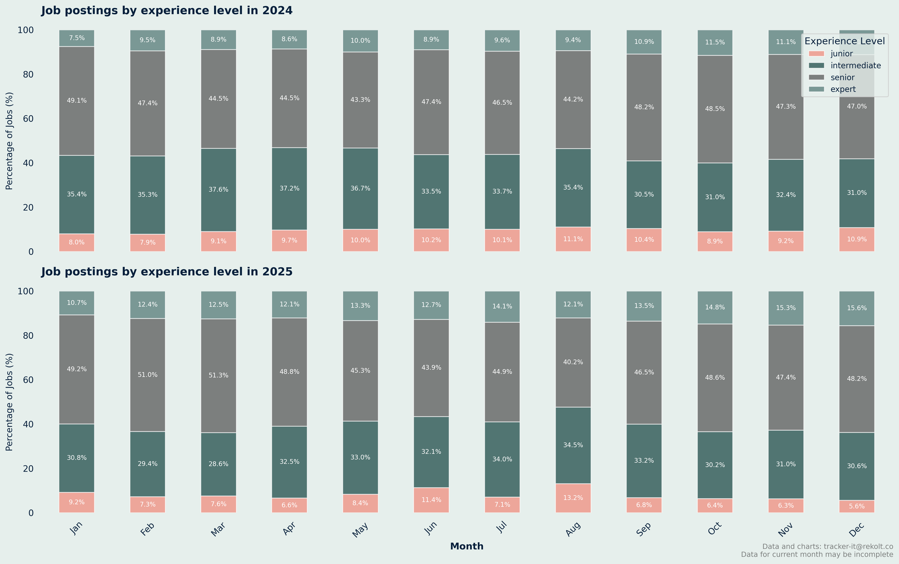
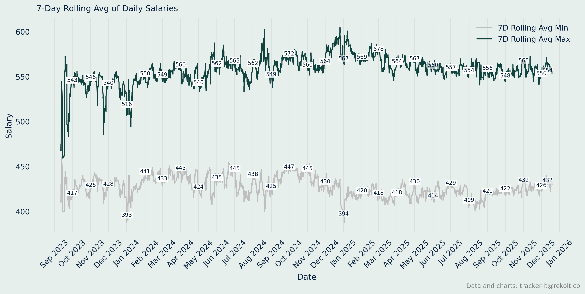

## Weekly Job Postings Summary

Every week, we deliver a comprehensive analysis of the French IT freelance landscape.

This report includes insights on job postings, remote work trends, salary analysis, and more.
* We maintain a backlog of analysis ideas. Send yours to tracker-it@rekolt.co.
* Join our [telegram channel](https://t.me/+3y9PJaF335UxYTg0) for weekly updates and for occasional REKOLT project briefs and mission descriptions.

### report for week starting December 15, 2025


### Weekly Vs Last Year Summary

```markdown
📈 Comparison Summary
2025: 27 weeks, 46833 total jobs, avg 1735 jobs/week
2024: 27 weeks, 47282 total jobs, avg 1751 jobs/week

```



### Ytd Cumlated Summary

```markdown

📈 Year-over-Year Comparison (Week 51):
2024: 95967 cumulative jobs
2025: 87419 cumulative jobs
Growth: -8.9%

```



### Month On Month Vs Last Year Summary

```markdown

📊 Monthly Job Postings Summary:
Jan: 2024=9877, 2025=8438
Feb: 2024=9128, 2025=6873
Mar: 2024=8794, 2025=7316
Apr: 2024=8896, 2025=7012
May: 2024=7629, 2025=6771
Jun: 2024=8331, 2025=8523
Jul: 2024=8036, 2025=7954
Aug: 2024=5865, 2025=5240
Sep: 2024=8401, 2025=8334
Oct: 2024=8972, 2025=8568
Nov: 2024=7019, 2025=7034
Dec: 2024=6013, 2025=5180

```



### Remote Vs Onsite Percentage Summary

```markdown

📊 Remote vs Onsite Job Postings Percentage Summary:

***The data previously provided here was obviously incorrect. The charts are fine in terms of percentages, but the absolute values are wrong.
We'll correct them later.***


```



### Experience Level Summary

```markdown
 Monthly Job Postings by Experience Level Summary:

***The data previously provided here was obviously incorrect. The charts are fine in terms of percentages, but the absolute values are wrong.
We'll correct them later.***

```



### Annual Salary Summary

```markdown
 Annual Salary Summary:
2023:
	 Average min salary: 428 
	 Average max salary: 543 

2024:
	 Average min salary: 434 
	 Average max salary: 560 

2025:
	 Average min salary: 422 
	 Average max salary: 562 

```



