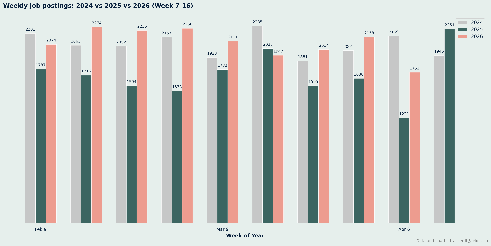
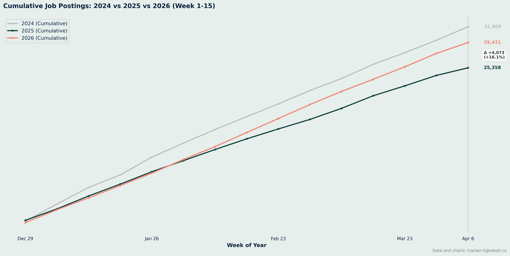
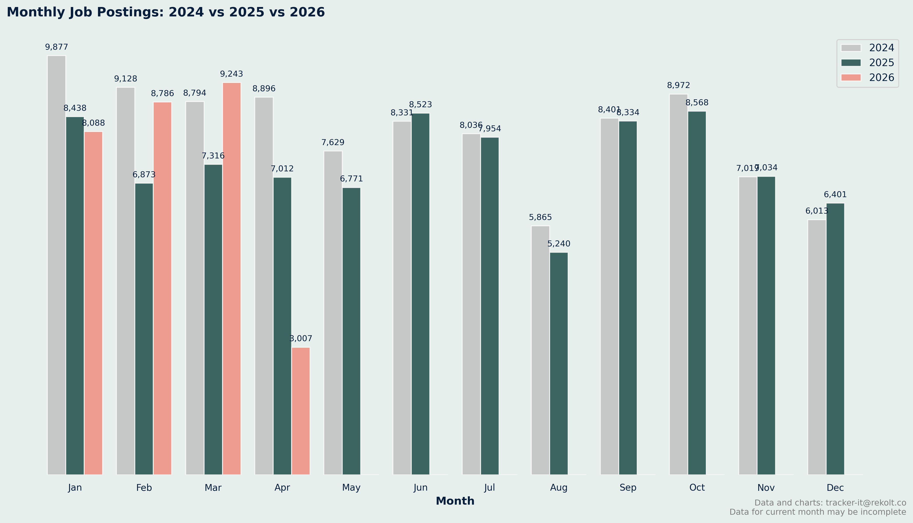
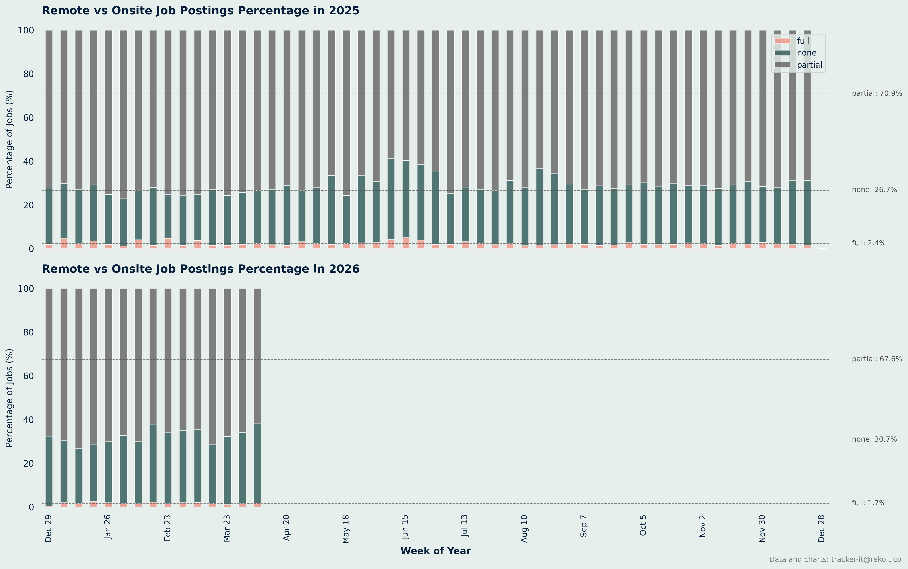
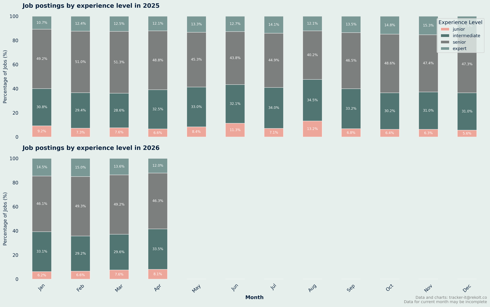
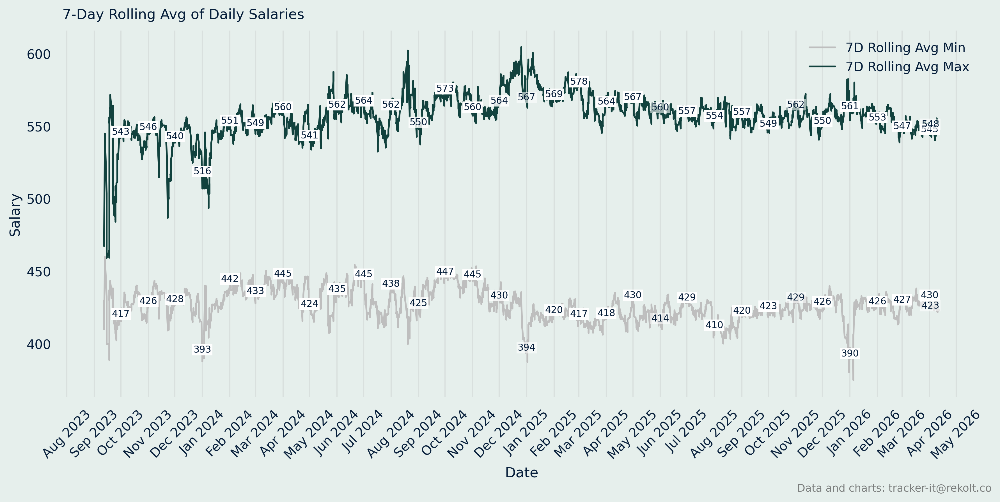

## Weekly Job Postings Summary

Every week, we deliver a comprehensive analysis of the French IT freelance landscape.

This report includes insights on job postings, remote work trends, salary analysis, and more.
* We maintain a backlog of analysis ideas. Send yours to tracker-it@rekolt.co.
* Join our [telegram channel](https://t.me/+3y9PJaF335UxYTg0) for weekly updates and for occasional REKOLT project briefs and mission descriptions.

### report for week starting April 06, 2026


### Weekly Vs Last Year Summary

```markdown
📈 Comparison Summary
2024: 9 weeks, 18732 total jobs, avg 2081 jobs/week
2025: 9 weeks, 14933 total jobs, avg 1659 jobs/week
2026: 9 weeks, 18824 total jobs, avg 2092 jobs/week

```



### Ytd Cumlated Summary

```markdown

📈 Year-over-Year Comparison (Week 15):
2025: 25358 cumulative jobs
2026: 29431 cumulative jobs
Growth: +16.1%

```



### Month On Month Vs Last Year Summary

```markdown

📊 Monthly Job Postings Summary:
Jan: 2024=9877, 2025=8438, 2026=8088
Feb: 2024=9128, 2025=6873, 2026=8786
Mar: 2024=8794, 2025=7316, 2026=9243
Apr: 2024=8896, 2025=7012, 2026=3007
May: 2024=7629, 2025=6771, 2026=  0
Jun: 2024=8331, 2025=8523, 2026=  0
Jul: 2024=8036, 2025=7954, 2026=  0
Aug: 2024=5865, 2025=5240, 2026=  0
Sep: 2024=8401, 2025=8334, 2026=  0
Oct: 2024=8972, 2025=8568, 2026=  0
Nov: 2024=7019, 2025=7034, 2026=  0
Dec: 2024=6013, 2025=6401, 2026=  0

```



### Remote Vs Onsite Percentage Summary

```markdown

📊 Remote vs Onsite Job Postings Percentage Summary:
2025: 5200 total pct-weeks
	 full: avg 2.4% per week
	 none: avg 26.7% per week
	 partial: avg 70.9% per week
2026: 1500 total pct-weeks
	 full: avg 1.7% per week
	 none: avg 30.7% per week
	 partial: avg 67.6% per week

```



### Experience Level Summary

```markdown
 Monthly Job Postings by Experience Level Summary:
2025:
	 Junior: 6799 jobs (7.9%)
	 Intermediate: 27232 jobs (31.6%)
	 Senior: 40625 jobs (47.2%)
	 Expert: 11427 jobs (13.3%)
2026:
	 Junior: 1861 jobs (6.9%)
	 Intermediate: 8289 jobs (30.9%)
	 Senior: 12899 jobs (48.1%)
	 Expert: 3789 jobs (14.1%)

```



### Annual Salary Summary

```markdown
 Annual Salary Summary:
2023:
	 Average min salary: 428 
	 Average max salary: 543 

2024:
	 Average min salary: 434 
	 Average max salary: 560 

2025:
	 Average min salary: 421 
	 Average max salary: 562 

2026:
	 Average min salary: 427 
	 Average max salary: 552 

```



