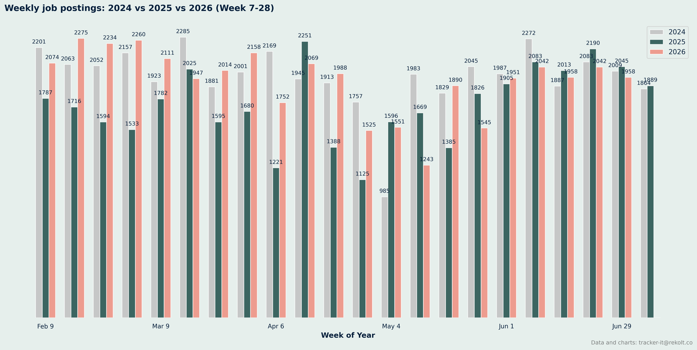
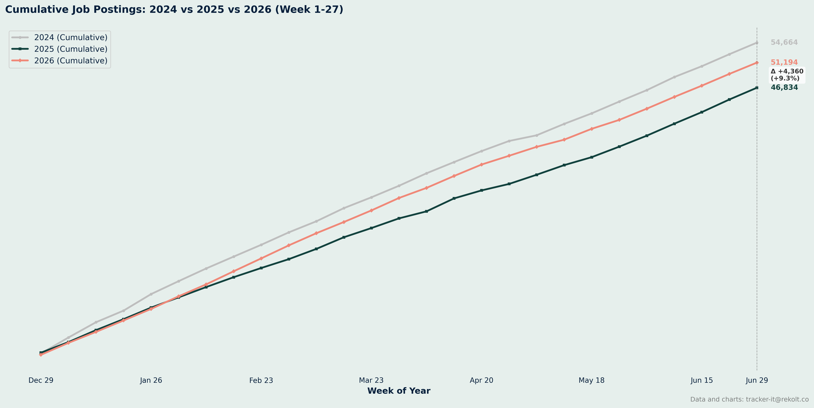
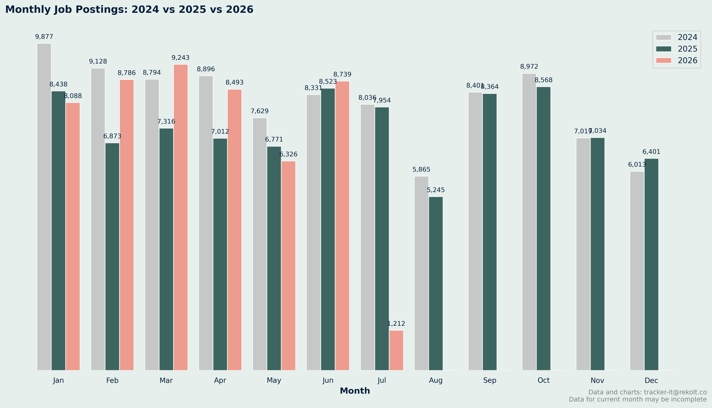
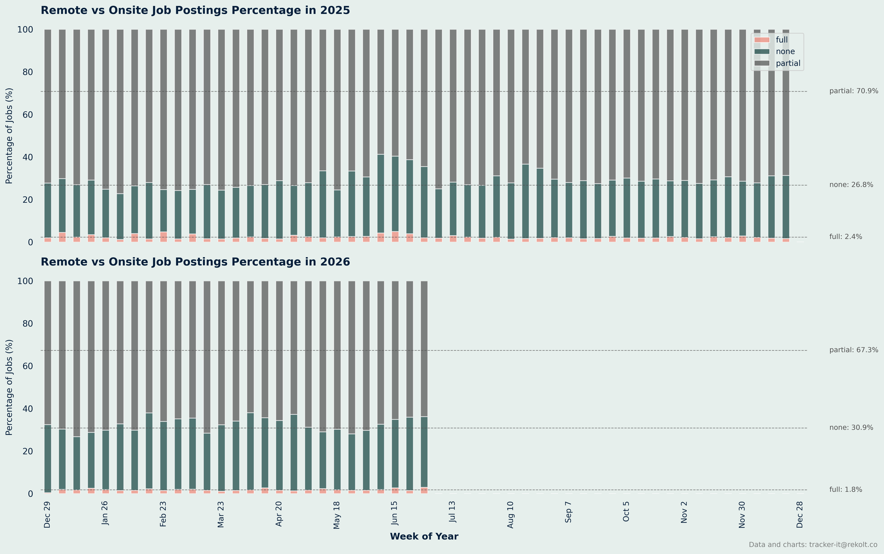
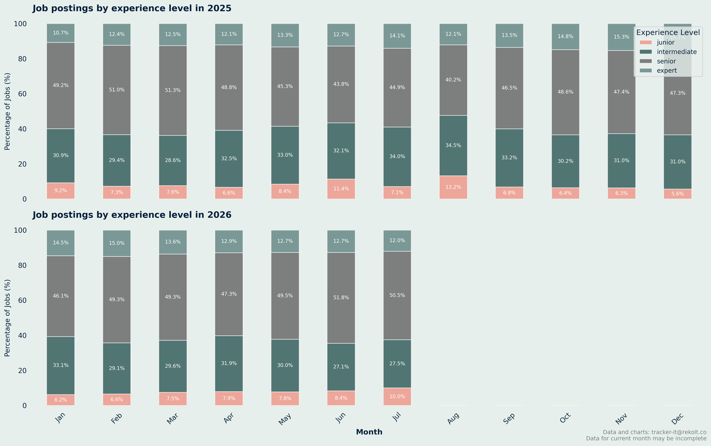
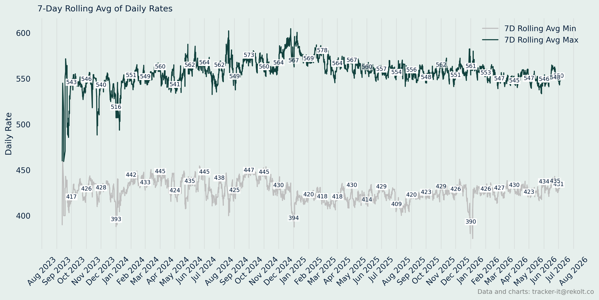

## Weekly Job Postings Summary

Every week, we deliver a comprehensive analysis of the French IT freelance landscape.

This report includes insights on job postings, remote work trends, salary analysis, and more.
* We maintain a backlog of analysis ideas. Send yours to tracker-it@rekolt.co.
* Join our [telegram channel](https://t.me/+3y9PJaF335UxYTg0) for weekly updates and for occasional REKOLT project briefs and mission descriptions.

### report for week starting June 29, 2026


### Weekly Vs Last Year Summary

```markdown
📈 Comparison Summary
2024: 21 weeks, 41427 total jobs, avg 1973 jobs/week
2025: 21 weeks, 36409 total jobs, avg 1734 jobs/week
2026: 21 weeks, 40587 total jobs, avg 1933 jobs/week

```



### Ytd Cumlated Summary

```markdown

📈 Year-over-Year Comparison (Week 27):
2025: 46834 cumulative jobs
2026: 51194 cumulative jobs
Growth: +9.3%

Note: Totals may differ slightly from the Weekly Comparison Summary. The cumulative chart starts from ISO week 1 (which can begin in late December of the prior year), while the weekly comparison skips week 1 when its Monday falls in the previous year.

```



### Month On Month Vs Last Year Summary

```markdown

Monthly Job Postings Summary:
Jan: 2024=9877, 2025=8438, 2026=8088
Feb: 2024=9128, 2025=6873, 2026=8786
Mar: 2024=8794, 2025=7316, 2026=9243
Apr: 2024=8896, 2025=7012, 2026=8493
May: 2024=7629, 2025=6771, 2026=6326
Jun: 2024=8331, 2025=8523, 2026=8739
Jul: 2024=8036, 2025=7954, 2026=1212
Aug: 2024=5865, 2025=5245, 2026=  0
Sep: 2024=8401, 2025=8364, 2026=  0
Oct: 2024=8972, 2025=8568, 2026=  0
Nov: 2024=7019, 2025=7034, 2026=  0
Dec: 2024=6013, 2025=6401, 2026=  0

```



### Remote Vs Onsite Percentage Summary

```markdown

Remote vs Onsite Job Postings Percentage Summary:
2025: 5200 total pct-weeks
	 full: avg 2.4% per week
	 none: avg 26.8% per week
	 partial: avg 70.9% per week
2026: 2700 total pct-weeks
	 full: avg 1.8% per week
	 none: avg 30.9% per week
	 partial: avg 67.3% per week

```



### Experience Level Summary

```markdown
 Monthly Job Postings by Experience Level Summary:
2025:
	 Junior: 6801 jobs (7.9%)
	 Intermediate: 27230 jobs (31.6%)
	 Senior: 40624 jobs (47.2%)
	 Expert: 11428 jobs (13.3%)
2026:
	 Junior: 3455 jobs (7.4%)
	 Intermediate: 13961 jobs (30.1%)
	 Senior: 22703 jobs (48.9%)
	 Expert: 6293 jobs (13.6%)

```



### Annual Salary Summary

```markdown
 Daily Rate Summary:
2023:
	 Average min daily rate: 428 
	 Average max daily rate: 543 

2024:
	 Average min daily rate: 434 
	 Average max daily rate: 560 

2025:
	 Average min daily rate: 421 
	 Average max daily rate: 561 

2026:
	 Average min daily rate: 428 
	 Average max daily rate: 552 

```



